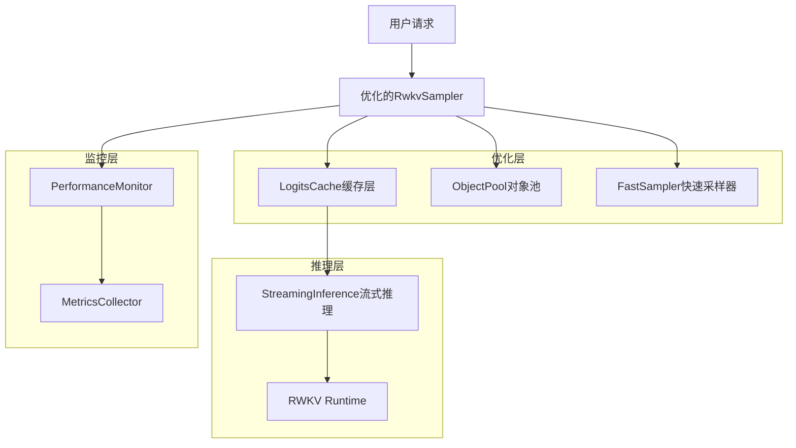
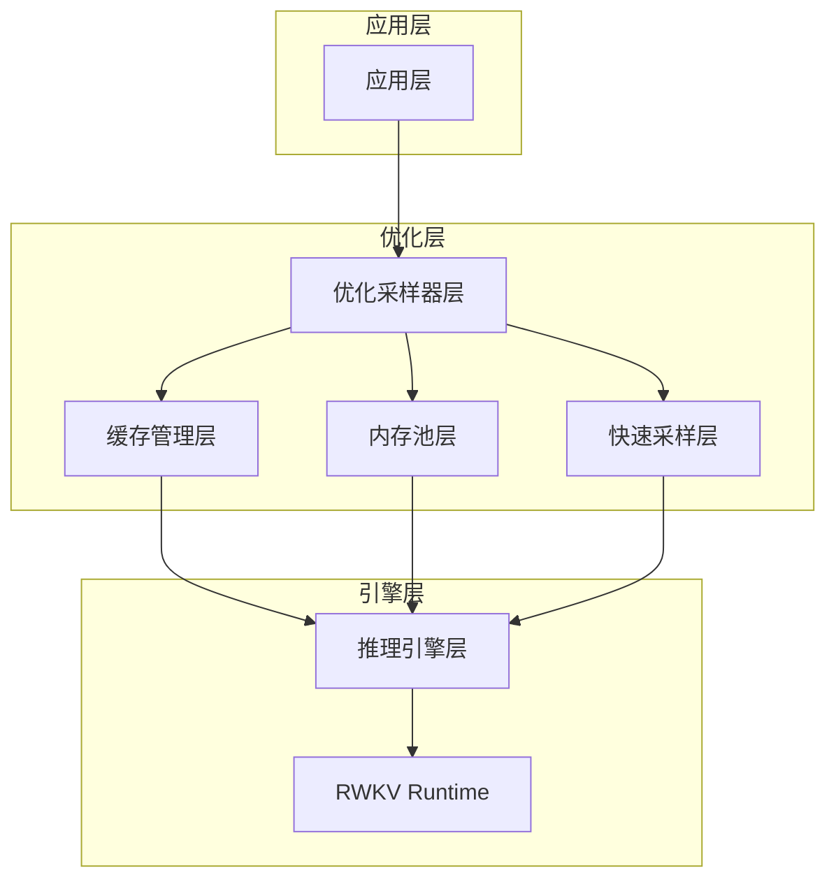
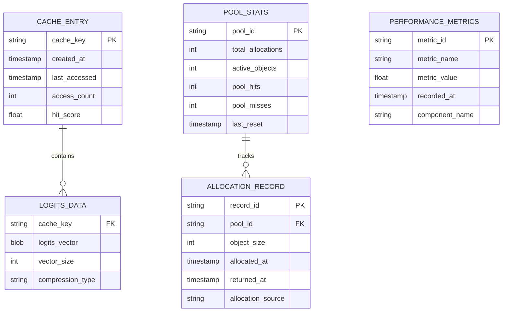

# LLM推理优化技术架构文档

## 1. 架构设计



## 2. 技术描述

- Frontend: 保持现有的Rust API接口
- Backend: 优化的推理引擎，包含缓存、对象池、快速采样等组件
- Cache: LogitsCache + ObjectPool内存管理
- Monitoring: 性能监控和指标收集

## 3. 路由定义

本项目为库项目，主要API接口如下：

| API方法 | 用途 |
|---------|------|
| RwkvSampler::new() | 创建优化的采样器实例 |
| generate_tts_tokens() | 生成TTS tokens（单个请求） |
| generate_tts_tokens_batch() | 批量生成TTS tokens |
| sample_logits() | 优化的采样函数 |
| reset() | 重置采样器状态 |

## 4. 核心组件API定义

### 4.1 LogitsCache组件

缓存管理相关接口

```rust
// 缓存键定义
struct CacheKey {
    context_tokens: Vec<u32>,
    position: usize,
    model_state_hash: u64,
}

// 缓存项定义
struct CacheEntry {
    logits: Vec<f32>,
    timestamp: Instant,
    access_count: u32,
}

// 缓存接口
impl LogitsCache {
    fn get(&self, key: &CacheKey) -> Option<&[f32]>;
    fn insert(&mut self, key: CacheKey, logits: Vec<f32>);
    fn evict_expired(&mut self, max_age: Duration);
    fn get_stats(&self) -> CacheStats;
}
```

### 4.2 ObjectPool组件

内存池管理接口

```rust
// 池化向量包装器
struct PooledVec<T> {
    inner: Vec<T>,
    pool: Weak<VecPool<T>>,
}

// 对象池接口
impl<T> VecPool<T> {
    fn new(initial_capacity: usize, max_pool_size: usize) -> Self;
    fn get_vec(&self, min_capacity: usize) -> PooledVec<T>;
    fn return_vec(&self, vec: Vec<T>);
    fn pool_stats(&self) -> PoolStats;
}
```

### 4.3 FastSampler组件

快速采样算法接口

```rust
// 采样配置
struct SamplingConfig {
    temperature: f32,
    top_k: usize,
    top_p: f32,
    use_simd: bool,
    fast_path_threshold: f32,
}

// 快速采样器接口
impl FastSampler {
    fn sample_optimized(
        &mut self,
        logits: &[f32],
        config: &SamplingConfig,
        rng: &mut StdRng,
    ) -> usize;
    
    fn sample_with_cache(
        &mut self,
        logits: &[f32],
        config: &SamplingConfig,
        cache_key: &str,
        rng: &mut StdRng,
    ) -> usize;
}
```

### 4.4 StreamingInference组件

流式推理管理接口

```rust
// 预取配置
struct PrefetchConfig {
    window_size: usize,
    max_prefetch: usize,
    prefetch_threshold: f32,
}

// 流式推理接口
impl StreamingInference {
    async fn get_logits_with_prefetch(
        &mut self,
        inference: &mut RnnInput,
        config: &PrefetchConfig,
    ) -> Result<Vec<f32>>;
    
    async fn batch_infer(
        &mut self,
        requests: Vec<InferenceRequest>,
    ) -> Result<Vec<Vec<f32>>>;
}
```

## 5. 服务器架构图



## 6. 数据模型

### 6.1 数据模型定义



### 6.2 内存数据结构

由于这是一个推理优化项目，主要使用内存数据结构，不需要持久化数据库。

**缓存数据结构**
```rust
// LRU缓存实现
struct LruCache<K, V> {
    map: HashMap<K, Box<Node<K, V>>>,
    head: *mut Node<K, V>,
    tail: *mut Node<K, V>,
    capacity: usize,
}

// 缓存节点
struct Node<K, V> {
    key: K,
    value: V,
    prev: *mut Node<K, V>,
    next: *mut Node<K, V>,
}
```

**对象池数据结构**
```rust
// 分层对象池
struct TieredObjectPool<T> {
    small_pool: Vec<Vec<T>>,    // < 1KB objects
    medium_pool: Vec<Vec<T>>,   // 1KB - 10KB objects  
    large_pool: Vec<Vec<T>>,    // > 10KB objects
    allocation_stats: PoolStats,
}

// 池统计信息
struct PoolStats {
    total_gets: AtomicU64,
    total_returns: AtomicU64,
    cache_hits: AtomicU64,
    cache_misses: AtomicU64,
    peak_usage: AtomicUsize,
}
```

**性能监控数据结构**
```rust
// 性能指标收集器
struct MetricsCollector {
    histograms: HashMap<String, Histogram>,
    counters: HashMap<String, AtomicU64>,
    gauges: HashMap<String, AtomicF64>,
    start_time: Instant,
}

// 采样性能指标
struct SamplingMetrics {
    total_samples: AtomicU64,
    fast_path_samples: AtomicU64,
    cache_hits: AtomicU64,
    avg_sample_time: AtomicF64,
    memory_allocations: AtomicU64,
}
```

## 7. 关键优化实现

### 7.1 SIMD优化的Softmax

```rust
#[cfg(target_arch = "x86_64")]
use std::arch::x86_64::*;

// SIMD加速的softmax计算
unsafe fn simd_softmax(input: &[f32], output: &mut [f32]) {
    let len = input.len();
    let simd_len = len & !7; // 8的倍数
    
    // 找到最大值（SIMD）
    let mut max_vec = _mm256_set1_ps(f32::NEG_INFINITY);
    for i in (0..simd_len).step_by(8) {
        let vals = _mm256_loadu_ps(input.as_ptr().add(i));
        max_vec = _mm256_max_ps(max_vec, vals);
    }
    
    // 计算exp和sum（SIMD）
    let mut sum_vec = _mm256_setzero_ps();
    for i in (0..simd_len).step_by(8) {
        let vals = _mm256_loadu_ps(input.as_ptr().add(i));
        let shifted = _mm256_sub_ps(vals, max_vec);
        let exp_vals = simd_exp_approx(shifted);
        _mm256_storeu_ps(output.as_mut_ptr().add(i), exp_vals);
        sum_vec = _mm256_add_ps(sum_vec, exp_vals);
    }
    
    // 归一化（SIMD）
    let inv_sum = _mm256_div_ps(_mm256_set1_ps(1.0), sum_vec);
    for i in (0..simd_len).step_by(8) {
        let vals = _mm256_loadu_ps(output.as_ptr().add(i));
        let normalized = _mm256_mul_ps(vals, inv_sum);
        _mm256_storeu_ps(output.as_mut_ptr().add(i), normalized);
    }
}
```

### 7.2 零拷贝Logits处理

```rust
// 零拷贝logits视图
struct LogitsView<'a> {
    data: &'a [f32],
    vocab_start: usize,
    vocab_end: usize,
    masked_tokens: &'a [usize],
}

impl<'a> LogitsView<'a> {
    fn effective_logit(&self, index: usize) -> f32 {
        if self.masked_tokens.contains(&index) {
            f32::NEG_INFINITY
        } else {
            self.data[index]
        }
    }
    
    fn iter_valid(&self) -> impl Iterator<Item = (usize, f32)> + '_ {
        (self.vocab_start..self.vocab_end)
            .filter(|&i| !self.masked_tokens.contains(&i))
            .map(|i| (i, self.data[i]))
    }
}
```

### 7.3 自适应缓存策略

```rust
// 自适应缓存管理器
struct AdaptiveCache {
    cache: LruCache<CacheKey, CacheEntry>,
    hit_rate_window: VecDeque<bool>,
    window_size: usize,
    min_hit_rate: f32,
    max_cache_size: usize,
}

impl AdaptiveCache {
    fn should_cache(&self, key: &CacheKey) -> bool {
        let current_hit_rate = self.calculate_hit_rate();
        
        // 如果命中率低，减少缓存
        if current_hit_rate < self.min_hit_rate {
            return false;
        }
        
        // 根据key的特征决定是否缓存
        self.is_cacheable_pattern(key)
    }
    
    fn adaptive_eviction(&mut self) {
        let hit_rate = self.calculate_hit_rate();
        
        if hit_rate < self.min_hit_rate {
            // 激进清理
            self.evict_low_value_entries();
        } else {
            // 正常LRU清理
            self.evict_lru();
        }
    }
}
```

## 8. 性能基准测试框架

### 8.1 基准测试结构

```rust
// 基准测试配置
struct BenchmarkConfig {
    test_cases: Vec<TestCase>,
    warmup_iterations: usize,
    measurement_iterations: usize,
    timeout: Duration,
}

// 测试用例
struct TestCase {
    name: String,
    input_tokens: Vec<i32>,
    sampling_args: SamplerArgs,
    expected_performance: PerformanceTarget,
}

// 性能目标
struct PerformanceTarget {
    max_latency_ms: f64,
    min_throughput_tps: f64,
    max_memory_mb: f64,
    max_cpu_percent: f64,
}
```

### 8.2 性能回归检测

```rust
// 性能回归检测器
struct RegressionDetector {
    baseline_metrics: HashMap<String, f64>,
    tolerance_percent: f64,
    consecutive_failures: usize,
}

impl RegressionDetector {
    fn check_regression(&mut self, current_metrics: &HashMap<String, f64>) -> bool {
        for (metric, &current_value) in current_metrics {
            if let Some(&baseline) = self.baseline_metrics.get(metric) {
                let change_percent = (current_value - baseline) / baseline * 100.0;
                
                if change_percent > self.tolerance_percent {
                    self.consecutive_failures += 1;
                    if self.consecutive_failures >= 3 {
                        return true; // 检测到回归
                    }
                }
            }
        }
        
        self.consecutive_failures = 0;
        false
    }
}
```

## 9. 部署和监控

### 9.1 特性开关

```rust
// 优化特性配置
#[derive(Debug, Clone)]
struct OptimizationConfig {
    enable_logits_cache: bool,
    enable_object_pool: bool,
    enable_simd_sampling: bool,
    enable_prefetch: bool,
    cache_size_mb: usize,
    pool_max_objects: usize,
}

// 运行时配置更新
impl RwkvSampler {
    fn update_config(&mut self, config: OptimizationConfig) {
        if config.enable_logits_cache != self.config.enable_logits_cache {
            self.toggle_cache(config.enable_logits_cache);
        }
        
        if config.cache_size_mb != self.config.cache_size_mb {
            self.resize_cache(config.cache_size_mb);
        }
        
        self.config = config;
    }
}
```

### 9.2 实时监控

```rust
// 实时性能监控
struct RealTimeMonitor {
    metrics_sender: mpsc::Sender<MetricEvent>,
    alert_thresholds: HashMap<String, f64>,
    monitoring_interval: Duration,
}

// 监控事件
enum MetricEvent {
    LatencyMeasurement { value: f64, timestamp: Instant },
    ThroughputMeasurement { value: f64, timestamp: Instant },
    MemoryUsage { bytes: usize, timestamp: Instant },
    CacheStats { hits: u64, misses: u64, timestamp: Instant },
}

impl RealTimeMonitor {
    async fn start_monitoring(&self) {
        let mut interval = tokio::time::interval(self.monitoring_interval);
        
        loop {
            interval.tick().await;
            self.collect_and_send_metrics().await;
        }
    }
}
```

## 10. 总结

本技术架构通过分层设计实现了LLM推理的全面优化：

- **缓存层**：减少重复计算，提升响应速度
- **内存池层**：减少内存分配开销，提升内存使用效率
- **快速采样层**：优化采样算法，支持SIMD加速
- **流式推理层**：实现预取和批量处理，减少推理调用开销
- **监控层**：提供实时性能监控和回归检测

整体架构保持了良好的模块化和可扩展性，支持渐进式优化部署和实时性能调优。