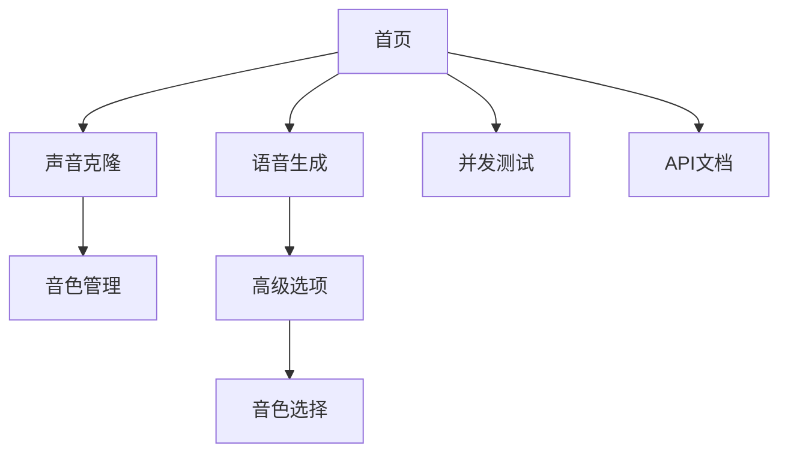

# Zero-shot 语音克隆流程重设计产品需求文档

## 1. Product Overview

本项目旨在重新设计RWKV TTS系统的Zero-shot语音克隆流程，通过预提取和缓存音色特征的方式，显著提升用户体验和系统性能。新设计将原有的实时特征提取模式改为预处理模式，用户可以预先上传参考音频并保存音色特征，后续语音生成时直接使用已保存的音色特征，避免重复计算。

该重设计解决了当前Zero-shot模式每次都需要重新提取特征导致的延迟问题，同时提供了更直观的音色管理界面。

## 2. Core Features

### 2.1 User Roles

本系统不区分用户角色，所有用户均可使用完整功能。

### 2.2 Feature Module

重设计后的系统包含以下主要页面：

1. **声音克隆页面**：音色特征提取和管理，包括文件上传、提示词输入、音色命名和特征保存功能。
2. **语音生成页面**：文本转语音合成，包括基础参数设置、高级选项配置和音色选择功能。
3. **并发测试页面**：系统性能测试，保持原有功能不变。
4. **API文档页面**：接口使用说明，更新新增的API端点信息。

### 2.3 Page Details

| Page Name | Module Name | Feature description |
|-----------|-------------|---------------------|
| 声音克隆页面 | 文件上传模块 | 支持WAV、MP3、FLAC、M4A格式音频文件上传，文件大小限制10MB |
| 声音克隆页面 | 提示词输入模块 | 文本框输入参考音频的描述信息，如说话风格、情感、语调等 |
| 声音克隆页面 | 音色命名模块 | 为提取的音色特征指定唯一名称，支持中英文和数字 |
| 声音克隆页面 | 特征提取模块 | 调用后端API提取音色特征并保存到raf目录，显示处理进度 |
| 声音克隆页面 | 音色管理模块 | 显示已保存的音色列表，支持预览、删除和重命名操作 |
| 语音生成页面 | 文本输入模块 | 多行文本框输入待合成的文本内容 |
| 语音生成页面 | 基础参数模块 | 温度、Top-P、语速等基础生成参数设置 |
| 语音生成页面 | 高级选项模块 | 包含音色选择、年龄、性别、情感、音调等高级参数 |
| 语音生成页面 | 音色选择模块 | 下拉框选择已保存的音色特征文件，支持"无音色"选项 |
| 语音生成页面 | 音频播放模块 | 生成结果的音频播放器和下载链接 |
| 并发测试页面 | 测试控制模块 | 保持原有并发测试功能不变 |
| API文档页面 | 文档展示模块 | 更新包含新增API端点的使用说明 |

## 3. Core Process

### 3.1 声音克隆流程

1. 用户进入声音克隆标签页
2. 上传参考音频文件（WAV/MP3/FLAC/M4A格式）
3. 输入音色描述提示词
4. 为音色指定唯一名称
5. 点击"提取音色特征"按钮
6. 系统调用特征提取API处理音频文件
7. 特征文件保存到raf目录，界面显示成功提示
8. 音色列表自动更新显示新添加的音色

### 3.2 语音生成流程

1. 用户进入语音生成标签页
2. 在文本框中输入待合成的文本
3. 展开高级选项（默认展开状态）
4. 在音色选择下拉框中选择预保存的音色（可选）
5. 调整其他生成参数（温度、语速等）
6. 点击"生成语音"按钮
7. 系统根据选择的音色文件进行Zero-shot推理
8. 返回生成的音频文件供播放和下载

### 3.3 页面导航流程图

## 4. User Interface Design

### 4.1 Design Style

- **主色调**：渐变蓝紫色（#667eea 到 #764ba2）
- **辅助色**：白色背景（#ffffff），浅灰色边框（#e2e8f0）
- **按钮样式**：圆角渐变按钮，悬停时有阴影效果
- **字体**：系统默认字体栈，标题使用1.5-2.5rem，正文使用1rem
- **布局风格**：卡片式布局，顶部标签导航
- **图标风格**：使用Emoji图标增强视觉效果

### 4.2 Page Design Overview

| Page Name | Module Name | UI Elements |
|-----------|-------------|-------------|
| 声音克隆页面 | 文件上传区域 | 拖拽上传框，支持点击选择，显示文件格式和大小限制 |
| 声音克隆页面 | 表单区域 | 提示词多行文本框，音色名称单行输入框，提取按钮 |
| 声音克隆页面 | 音色列表 | 卡片式布局，每个音色显示名称、创建时间、操作按钮 |
| 语音生成页面 | 高级选项面板 | 默认展开的折叠面板，包含多个标签页式子选项 |
| 语音生成页面 | 音色选择器 | 下拉选择框，显示音色名称和创建时间，支持搜索 |
| 语音生成页面 | 参数控制区 | 滑块和数字输入框组合，实时显示参数值 |

### 4.3 Responsiveness

系统采用响应式设计，优先适配桌面端，同时支持平板和手机端访问。在移动设备上，标签导航改为垂直堆叠，表单元素调整为单列布局。