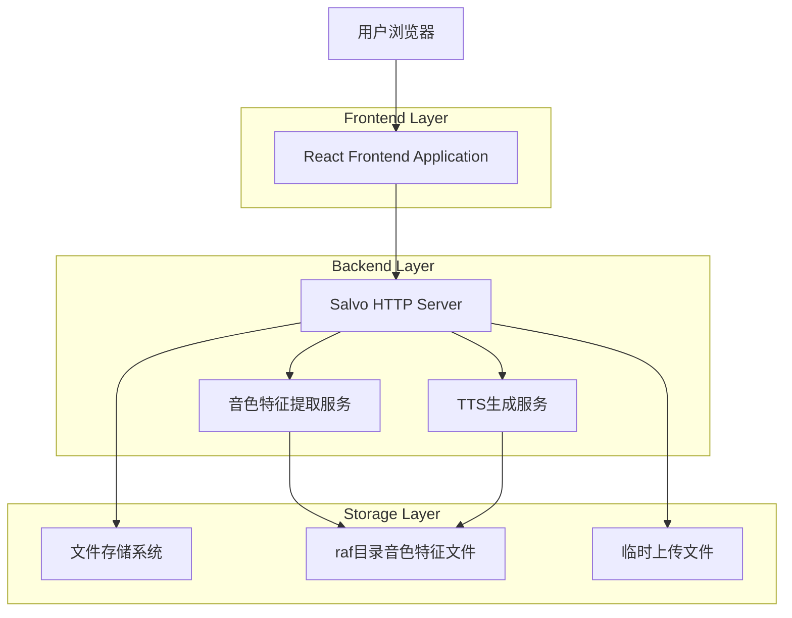
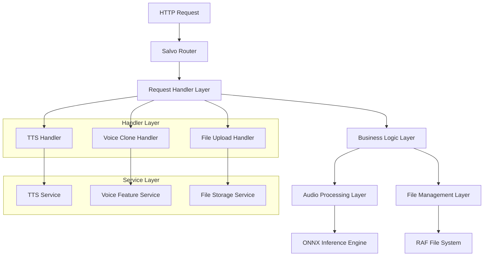
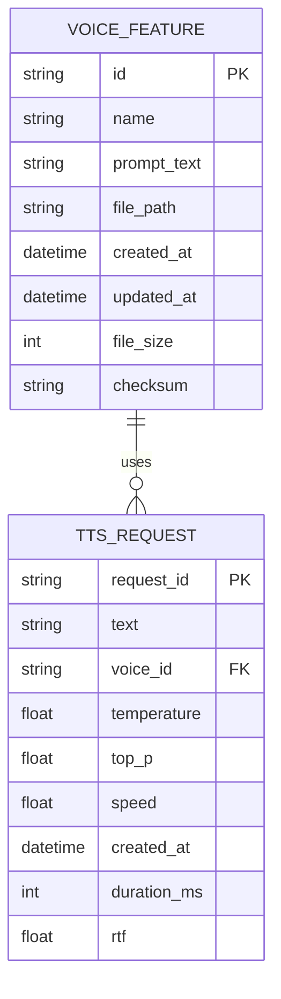

# Zero-shot 语音克隆流程重设计技术架构文档

## 1. Architecture design



## 2. Technology Description

* Frontend: HTML5 + CSS3 + Vanilla JavaScript

* Backend: Rust + Salvo Framework + ONNX Runtime

* Audio Processing: hound + ndarray + 自定义音频处理模块

* File Storage: 本地文件系统（raf目录）

* Model Inference: ONNX Runtime + BiCodec + wav2vec2

## 3. Route definitions

| Route                    | Purpose             |
| ------------------------ | ------------------- |
| /                        | 主页面，包含所有标签页的静态资源    |
| /api/tts                 | 原有TTS生成API，支持音色文件选择 |
| /api/voice-clone/extract | 新增：音色特征提取API        |
| /api/voice-clone/list    | 新增：获取已保存音色列表API     |
| /api/voice-clone/delete  | 新增：删除音色特征文件API      |
| /api/voice-clone/rename  | 新增：重命名音色特征文件API     |

## 4. API definitions

### 4.1 Core API

#### 音色特征提取API

```
POST /api/voice-clone/extract
```

Request (multipart/form-data):

| Param Name | Param Type | isRequired | Description              |
| ---------- | ---------- | ---------- | ------------------------ |
| audioFile  | file       | true       | 参考音频文件（WAV/MP3/FLAC/M4A） |
| promptText | string     | true       | 音色描述提示词                  |
| voiceName  | string     | true       | 音色名称（唯一标识）               |

Response:

| Param Name | Param Type | Description |
| ---------- | ---------- | ----------- |
| success    | boolean    | 提取是否成功      |
| message    | string     | 响应消息        |
| voiceId    | string     | 生成的音色ID     |
| filePath   | string     | 保存的特征文件路径   |

Example Response:

```json
{
  "success": true,
  "message": "音色特征提取成功",
  "voiceId": "voice_20241201_001",
  "filePath": "raf/voice_20241201_001.raf"
}
```

#### 获取音色列表API

```
GET /api/voice-clone/list
```

Response:

| Param Name | Param Type | Description |
| ---------- | ---------- | ----------- |
| success    | boolean    | 请求是否成功      |
| voices     | array      | 音色列表        |

Voice Object:

| Param Name | Param Type | Description |
| ---------- | ---------- | ----------- |
| id         | string     | 音色ID        |
| name       | string     | 音色名称        |
| promptText | string     | 原始提示词       |
| createdAt  | string     | 创建时间        |
| filePath   | string     | 特征文件路径      |

Example Response:

```json
{
  "success": true,
  "voices": [
    {
      "id": "voice_20241201_001",
      "name": "温柔女声",
      "promptText": "这是一个温和的女性声音",
      "createdAt": "2024-12-01T10:30:00Z",
      "filePath": "raf/voice_20241201_001.raf"
    }
  ]
}
```

#### 删除音色API

```
DELETE /api/voice-clone/delete
```

Request:

| Param Name | Param Type | isRequired | Description |
| ---------- | ---------- | ---------- | ----------- |
| voiceId    | string     | true       | 要删除的音色ID    |

Response:

| Param Name | Param Type | Description |
| ---------- | ---------- | ----------- |
| success    | boolean    | 删除是否成功      |
| message    | string     | 响应消息        |

#### 修改后的TTS生成API

```
POST /api/tts
```

新增参数:

| Param Name | Param Type | isRequired | Description               |
| ---------- | ---------- | ---------- | ------------------------- |
| voiceId    | string     | false      | 选择的音色ID，替代原有的zero\_shot参数 |

## 5. Server architecture diagram



## 6. Data model

### 6.1 Data model definition



### 6.2 Data Definition Language

#### 音色特征文件结构（RAF格式）

```rust
// 音色特征文件结构定义
#[derive(Serialize, Deserialize)]
struct VoiceFeature {
    pub id: String,
    pub name: String,
    pub prompt_text: String,
    pub created_at: DateTime<Utc>,
    pub global_tokens: Vec<i64>,
    pub semantic_tokens: Vec<i64>,
    pub audio_duration: f32,
    pub sample_rate: u32,
    pub checksum: String,
}
```

#### 音色元数据文件（JSON格式）

```json
// raf/voices_metadata.json
{
  "voices": [
    {
      "id": "voice_20241201_001",
      "name": "温柔女声",
      "promptText": "这是一个温和的女性声音",
      "createdAt": "2024-12-01T10:30:00Z",
      "filePath": "raf/voice_20241201_001.raf",
      "fileSize": 1024,
      "checksum": "sha256:abc123..."
    }
  ]
}
```

#### 目录结构

```
raf/
├── voices_metadata.json          # 音色元数据索引文件
├── voice_20241201_001.raf        # 音色特征文件
├── voice_20241201_002.raf        # 音色特征文件
└── temp/                         # 临时文件目录
    └── upload_temp_files/        # 上传临时文件
```

#### 关键实现细节

1. **特征文件格式**：使用二进制序列化格式存储音色特征，包含global\_tokens和semantic\_tokens
2. **文件命名规则**：voice\_{timestamp}\_{sequence}.raf
3. **元数据管理**：使用JSON文件维护音色列表和元信息
4. **并发安全**：使用文件锁确保元数据文件的并发读写安全
5. **错误处理**：完整的错误处理机制，包括文件损坏检测和恢复
6. **性能优化**：音色特征文件采用内存映射方式读取，提升加载速度

