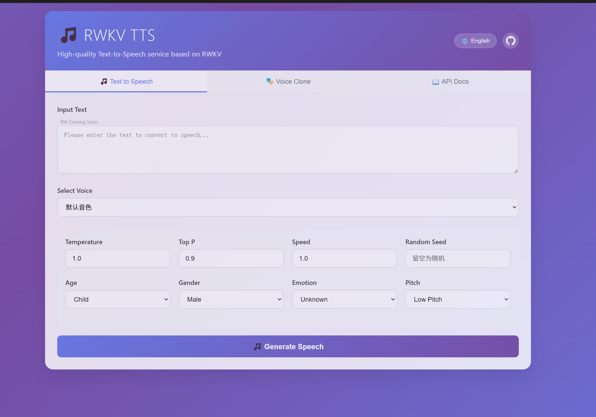

# RWKV TTS Rust

<div align="center">

[](LICENSE)
[](https://www.rust-lang.org)

**High-performance Text-to-Speech with RWKV Language Models**

</div>

<div align="center">
  <p>中文版本 | <a href="README_en.md">English Version</a></p>
</div>

## 简介

RWKV TTS Rust 是一个使用 Rust 构建的高性能语音合成实现，基于 RWKV 语言模型，具有以下特点：

- 🚀 单文件部署，内嵌 Web UI 界面
- ⚡ 高性能 TTS 生成
- 🎯 语音克隆，支持参考音频
- 🎛️ 可定制语音属性（音调、语速、情感、年龄、性别）
- 🌍 多语言支持，自动下载模型



## 编译

### 自动编译

使用提供的构建脚本自动完成编译：

```bash
# Linux/macOS
sh build.sh

# Windows (使用 PowerShell)
.\build.ps1
```

构建脚本将自动：
- 下载所需模型
- 配置 ONNX Runtime
- 编译包含内嵌 Web UI 的单文件可执行程序

### 手动编译

```bash
# 构建 release 版本
cargo build --release

# 运行服务器
cargo run --release --bin rwkvtts_server
```

## 运行

编译完成后，可以通过以下方式运行：

```bash
# 使用默认端口 3000
cargo run --release --bin rwkvtts_server

# 或指定自定义端口
cargo run --release --bin rwkvtts_server -- --port 8080
```

然后在浏览器中打开 http://localhost:3000 访问 Web 界面。

## 从 Releases 下载

对于不想自行编译的用户，可以从 [Releases 页面](https://github.com/cgisky1980/rwkv-tts-rs/releases) 下载预编译的可执行文件：

1. 访问 [Releases 页面](https://github.com/cgisky1980/rwkv-tts-rs/releases)
2. 下载适用于您操作系统的预编译版本
3. 解压下载的文件
4. 运行可执行文件：
   - Windows: 双击 `rwkvtts_server.exe` 或在命令行运行
   - Linux/macOS: 在终端运行 `./rwkvtts_server`

首次运行时会自动下载所需的模型文件。

## 许可证

MIT License

---

